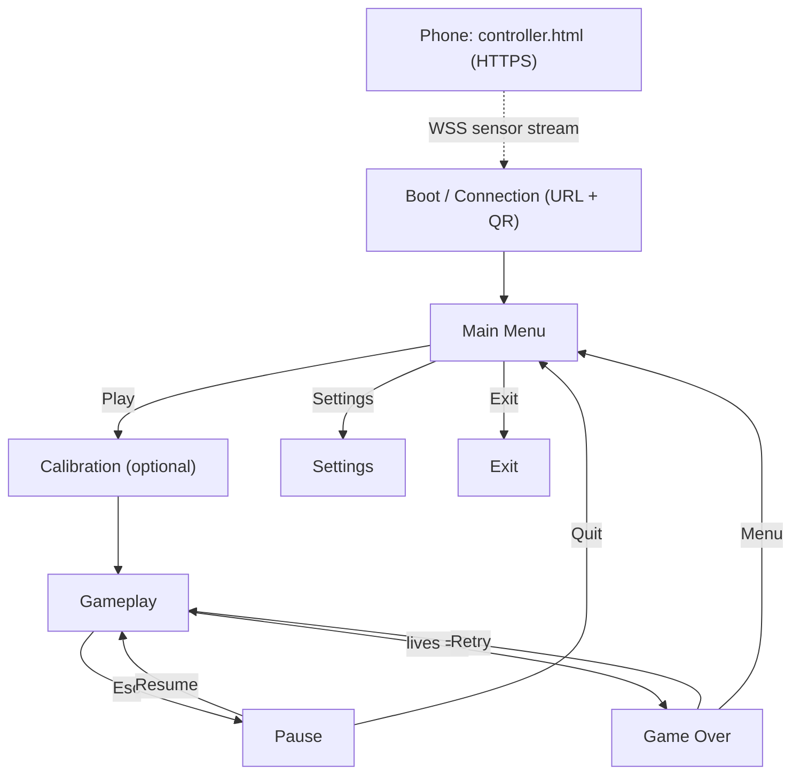

# Project: Phone Ninja (`fruit-ninja-motion`)

Local-only game. Laptop = authoritative engine + renderer. Android phone = wireless IMU controller via a browser page the laptop serves over HTTPS, streaming `DeviceMotion` data over WSS. No backend, no cloud, all state in memory.

---

## 1. Information Architecture (screens, navigation, flow)

Screens are a finite state machine; the engine swaps the active `Scene`. Connection status is always visible.

- Boot / Connection screen: shows LAN HTTPS URL + QR code, waits for phone to connect, shows live raw-sensor debug readout.
- Main Menu: Play / Settings / Exit.
- Calibration (optional/skippable): capture neutral pose, set sensitivity.
- Gameplay: shapes rise/fall, slice trail, HUD (score, combo, lives, connection, FPS in dev).
- Pause overlay: Resume / Settings / Quit to menu.
- Game Over: final score, best score (session only), Retry / Menu.
- Phone controller page (separate "screen" on the phone): a single HTML/JS page with a big "Enable Motion + Connect" button and a connection indicator.

Navigation = `GameState` enum driving `Engine.set_scene()`. A keyboard/mouse fallback controller works in every screen so the game is fully usable without a phone.

User flow: launch laptop app -> Connection screen shows URL + QR -> phone scans, opens HTTPS page, taps Enable Motion -> streams data -> (optional) Calibrate -> Play -> flick to slash shapes -> Game Over -> Retry/Menu.

### Sitemap

---

## 2. Component Structure (modules and classes)

Maps onto the proposed folders. Reusable primitives called out.

- `main.py`: entrypoint; builds config, starts network thread, runs `Engine`.
- `game/`
  - `engine.py`: main loop (fixed-timestep update + render), scene manager, drains sensor queue.
  - `game.py`: gameplay scene (spawning, difficulty, score/lives/combo).
  - `objects.py`: `GameObject` (Circle/Square/Triangle) + object pool. Reusable.
  - `physics.py`: `Vector2`, position/velocity/gravity/rotation integration. Reusable.
  - `collision.py`: segment-vs-shape tests (slice line vs object).
  - `renderer.py`: draws background, objects, slice trail, particles, HUD.
  - `particles.py`: particle emitter + pool. Reusable.
  - `ui.py`: Scene base class, menus, buttons, HUD widgets, QR display. Reusable.
  - `audio.py`: sound manager (slice / destroy / game over / music). Reusable.
- `network/` (M1+)
  - `websocket_server.py`, `packet.py`, `protocol.py`, `cert.py`
  - `controller/controller.html` (+ JS)
- `controller/`
  - `base.py`: `Controller` Protocol + `SliceInput`
  - `fallback.py`: mouse/keyboard controller
  - (M2+) `sensor_processor.py`, `filters.py`, `calibration.py`, `gesture_detector.py`, `slice_generator.py`, `recorder.py`
- `config/settings.py`: dataclass config
- `tests/`: unit tests per subsystem

Composition: `Engine` owns the active `Scene`; `Scene` composes systems. Input is abstracted behind a `Controller` interface so `MotionController` and `FallbackController` are interchangeable.

### Data flow

```mermaid
flowchart LR
    Phone["Phone DeviceMotion"] -->|WSS JSON| Server["aiohttp WSS server (thread)"]
    Server --> Queue["Thread-safe queue"]
    Queue --> Proc["sensor_processor"]
    Proc --> Filt["filters"] --> Cal["calibration"] --> Gest["gesture_detector"] --> Slice["slice_generator"]
    Slice --> Coll["collision"]
    Coll --> Logic["game logic"]
    Logic --> Render["renderer + particles + audio"]
```

---

## 3. Visual Direction

Layout style: bold, high-contrast, motion-forward dark-mode arcade. Minimal chrome during play (HUD in corners), centered menus, glow/particle emphasis on the slice trail.

**Palette A (Neon Arcade — active):** bg `#0E1116`, cyan `#22D3EE`, magenta `#F0398B`, lime `#A3E635`, amber `#FBBF24`.

Alternatives: Sunset Zen; Minimal Mono + Accent.

Typography: Orbitron / Chakra Petch (display) + Inter (body) — system fonts for M0.

---

## 4. Technical Requirements

- In-memory only: game objects, slice paths, score/lives/combo, settings, session best.
- No cloud / no DB / no REST.
- Tech: Python 3.11+, pygame-ce, (later) aiohttp, cryptography, numpy, qrcode, pytest.
- Performance: 60 FPS target, fixed-timestep update, object pooling.

---

## 5. Incremental Roadmap

### M0 (FIRST): Playable baseline with mouse/keyboard fallback

Define `Controller` Protocol + `SliceInput`. Build `FallbackController` and a fully playable game with zero networking.

Exit criterion: shapes rise/fall, mouse-drag slices them, score/lives/game-over work.

### Later

- M1 Networking (HTTPS + WSS + controller.html + QR)
- M2 Sensor pipeline + record/replay
- M3 Gesture + slicing from phone
- M4 Particles, audio, combos, difficulty
- M5 Polish, settings, tests, README
