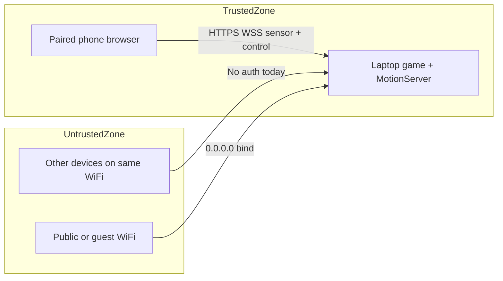
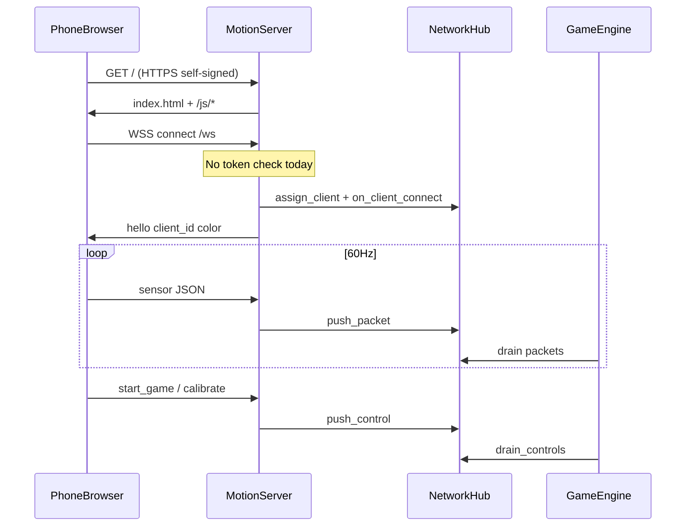

# Phone Ninja — Security Plan

> **Living document** — last audited: 2026-07-15  
> Update this file as you implement mitigations. Check off items when done.

---

## 1. Scope & Threat Model

### What this application is

Phone Ninja is a **local, LAN-only** motion-controlled game:

| Layer | Technology | Key files |
|-------|------------|-----------|
| Desktop game | Python + pygame-ce | [`main.py`](../main.py), [`game/engine.py`](../game/engine.py) |
| Network server | aiohttp HTTPS + WSS on port 8765 | [`network/websocket_server.py`](../network/websocket_server.py) |
| Phone controller | Static HTML/JS (DeviceMotion API) | [`phone/index.html`](../phone/index.html), [`phone/js/*.js`](../phone/js/) |
| TLS | Self-signed RSA-2048 cert | [`network/cert.py`](../network/cert.py) |
| Config | In-memory dataclass (no `.env`) | [`config/settings.py`](../config/settings.py) |

There is **no database**, **no cloud backend**, **no user accounts**, and **no environment-based secrets** today.

### Stack documentation mismatch

[`.cursor/rules/tech-stack.mdc`](rules/tech-stack.mdc) describes a React + TypeScript + Bun stack. The actual codebase is Python + vanilla JS. Treat that rule as **stale** until updated — following it during development could introduce wrong security assumptions (e.g. `VITE_` env vars, CSRF tokens for REST APIs that do not exist).

### Trust boundaries



### Assumed adversaries

| Adversary | Capability | Relevance |
|-----------|------------|-----------|
| **LAN neighbor** | Same Wi-Fi; can scan port 8765, connect WebSocket, send sensor/control messages | **High** — no pairing today |
| **Malicious web page** | Tricks browser into cross-origin WebSocket (CSWSH) | Medium — no Origin check today |
| **MITM on LAN** | Intercepts or replays WSS traffic | Low-Medium — self-signed cert; users bypass warnings |
| **Local file attacker** | Writes/overwrites files via path tricks | Low — recordings path is timestamp-based today |
| **Supply chain** | Compromised PyPI package | Low-Medium — unpinned dependencies |

### Out of scope (today)

- GDPR/PCI/HIPAA compliance (no PII, payments, or health data stored)
- Internet-facing deployment
- Multi-tenant or persistent user accounts

Re-evaluate scope if you add cloud sync, leaderboards, accounts, or public hosting.

---

## 2. Prioritized Checklist

Items are ordered by **impact × likelihood** for the current LAN-only design. P0 = fix before playing on untrusted networks; P3 = hygiene.

### P0 — Critical (unauthenticated remote control)

- [x] **Add session pairing token to QR URL and validate on WebSocket connect** *(2026-07-15)*  
  **Why:** Any device on the LAN can currently send `start_game`, `stop_game`, `calibrate`, and forged `sensor` packets with no proof of pairing.  
  **Files:** [`network/websocket_server.py`](../network/websocket_server.py) (`_handle_ws`), [`network/hub.py`](../network/hub.py), [`network/qr_util.py`](../network/qr_util.py), [`game/ui.py`](../game/ui.py) (QR display), [`phone/js/websocket.js`](../phone/js/websocket.js) (pass token in hello/URL)

- [x] **Reject WebSocket connections without valid pairing token** *(2026-07-15)*  
  **Why:** Pairing token in the page URL alone is insufficient if `/ws` stays open to anyone who discovers the port.  
  **Files:** [`network/websocket_server.py`](../network/websocket_server.py), [`network/protocol.py`](../network/protocol.py)

- [x] **Bind server to specific LAN IP instead of `0.0.0.0` by default** *(2026-07-15)*  
  **Why:** `0.0.0.0` exposes the service on every interface, including public Wi-Fi adapters.  
  **Files:** [`config/settings.py`](../config/settings.py) (`ws_host`), [`network/websocket_server.py`](../network/websocket_server.py), [`network/cert.py`](../network/cert.py) (`get_primary_lan_ip`)

- [x] **Show in-game warning when server binds to all interfaces or untrusted network detected** *(2026-07-15)*  
  **Why:** Users may not realize cafe Wi-Fi exposes their game to strangers.  
  **Files:** [`game/ui.py`](../game/ui.py), [`config/settings.py`](../config/settings.py), [`network/websocket_server.py`](../network/websocket_server.py) (`bound_all_interfaces`)

### P1 — High (input validation, transport trust)

- [ ] **Validate WebSocket `Origin` / `Host` headers against expected LAN origin**  
  **Why:** Prevents cross-site WebSocket hijacking (CSWSH) from malicious sites visited on the phone.  
  **Files:** [`network/websocket_server.py`](../network/websocket_server.py) (`_handle_ws`)

- [ ] **Set `max_msg_size` on WebSocket and reject oversized frames**  
  **Why:** Unbounded JSON payloads enable memory exhaustion DoS.  
  **Files:** [`network/websocket_server.py`](../network/websocket_server.py)

- [ ] **Validate and clamp sensor numeric fields; reject NaN/Inf**  
  **Why:** Malformed floats can corrupt aim/physics math downstream.  
  **Files:** [`network/packet.py`](../network/packet.py), [`controller/aim.py`](../controller/aim.py), [`game/physics.py`](../game/physics.py)

- [ ] **Rate-limit messages per connection (sensor + control)**  
  **Why:** A flood of ~60 Hz sensor packets from multiple clients can starve the game loop.  
  **Files:** [`network/websocket_server.py`](../network/websocket_server.py), [`network/hub.py`](../network/hub.py)

- [ ] **Ensure TLS private key is never committed; restrict file permissions on `key.pem`**  
  **Why:** Key disclosure allows MITM impersonation of the game server on the LAN.  
  **Files:** [`network/cert.py`](../network/cert.py), [`.gitignore`](../.gitignore)

- [ ] **Shorten self-signed cert validity and document trust model in README**  
  **Why:** 825-day certs and "click through warning" train bad security habits.  
  **Files:** [`network/cert.py`](../network/cert.py), [`README.md`](../README.md)

### P2 — Medium (resilience, local data, frontend hardening)

- [ ] **Cap concurrent WebSocket clients (e.g. max 4)**  
  **Why:** No connection limit today; hub tracks `client_count` but never rejects.  
  **Files:** [`network/websocket_server.py`](../network/websocket_server.py), [`network/hub.py`](../network/hub.py)

- [ ] **Constrain recording output paths to `recordings/` directory**  
  **Why:** `SensorRecorder.start(path=...)` accepts arbitrary paths — safe today but fragile if wired to user input later.  
  **Files:** [`controller/recorder.py`](../controller/recorder.py)

- [ ] **Validate server-assigned `color` against `CLIENT_COLORS` palette before DOM injection**  
  **Why:** `setClientInfo` writes server color into `style.borderLeft`; a compromised server response could inject CSS.  
  **Files:** [`phone/js/ui.js`](../phone/js/ui.js), [`network/hub.py`](../network/hub.py)

- [ ] **Add Content-Security-Policy header on served HTML/JS**  
  **Why:** Defense-in-depth against XSS if future code introduces `innerHTML` or third-party scripts.  
  **Files:** [`network/websocket_server.py`](../network/websocket_server.py) (`_handle_index`), [`phone/index.html`](../phone/index.html)

- [ ] **Disable `debug: True` and `infinite_lives: True` defaults for release builds**  
  **Why:** Debug defaults leak internal state in overlays and weaken gameplay integrity during demos.  
  **Files:** [`config/settings.py`](../config/settings.py)

### P3 — Low (dependency hygiene, documentation)

- [ ] **Pin dependency versions in `requirements.txt`; add lockfile or `requirements-lock.txt`**  
  **Why:** Unpinned `>=` ranges allow silent CVE introduction on fresh installs.  
  **Files:** [`requirements.txt`](../requirements.txt)

- [ ] **Run `pip-audit` (or equivalent) in CI or pre-release checklist**  
  **Why:** Catches known CVEs in aiohttp, cryptography, Pillow.  
  **Files:** [`requirements.txt`](../requirements.txt)

- [ ] **Update `.cursor/rules/tech-stack.mdc` to match Python + aiohttp stack**  
  **Why:** Stale rules cause wrong security guidance during AI-assisted development.  
  **Files:** [`.cursor/rules/tech-stack.mdc`](rules/tech-stack.mdc)

- [ ] **Initialize git repo and verify `network/certs/` + `*.pem` stay untracked**  
  **Why:** Cert/key files exist in the working tree; without git, `.gitignore` provides no enforcement.  
  **Files:** [`.gitignore`](../.gitignore), [`network/certs/`](../network/certs/)

---

## 3. Security Areas — Detail

### 3.1 Authentication & Session Flows

**Entry points**

| Flow | Location | Current behavior |
|------|----------|------------------|
| Phone → server connect | [`phone/js/websocket.js`](../phone/js/websocket.js) `connect()` | Sends `{ type: "hello", role: "phone" }` — no secret |
| Server → client assign | [`network/websocket_server.py`](../network/websocket_server.py) `_handle_ws` | Assigns `client_id` + color immediately |
| Remote game control | [`phone/js/calibration.js`](../phone/js/calibration.js) | `start_game`, `stop_game`, `calibrate` — no auth |
| Control dispatch | [`game/engine.py`](../game/engine.py) `process_controls()` | Drains hub queue, acts on any `ControlEvent` |

**Threat vectors**

| ID | Threat | Description |
|----|--------|-------------|
| AUTH-1 | **Auth bypass** | Any LAN client connects to `/ws` and controls the game |
| AUTH-2 | **Session hijack** | Attacker connects concurrently; last client wins (`active_client_id` in hub) |
| AUTH-3 | **Input injection** | Forged `sensor` packets manipulate blade position / collision |
| AUTH-4 | **Griefing** | Remote `stop_game` / spam calibrate disrupts session |

**Mitigations (recommended implementation order)**

1. Generate a random 32-byte pairing token at server start (`secrets.token_urlsafe`).
2. Embed token in QR URL: `https://<lan-ip>:8765/?token=<token>`.
3. Phone reads token from `URLSearchParams`, sends in first `hello` message.
4. Server stores expected token; reject `/ws` if `hello.token` mismatch (close with 4401).
5. Optionally rotate token on each game launch or after N minutes.
6. For multi-player (future): bind `client_id` to token, enforce max clients.

**Standards & references**

- OWASP ASVS V2 (Authentication), V3 (Session Management)
- CWE-306: Missing Authentication for Critical Function
- CWE-287: Improper Authentication

---

### 3.2 Data Storage & API Access

**Entry points**

| Data | Storage | Access |
|------|---------|--------|
| Game settings | In-memory [`config/settings.py`](../config/settings.py) | Local only |
| Sensor recordings | JSONL in `recordings/` | [`controller/recorder.py`](../controller/recorder.py) |
| TLS key/cert | `network/certs/key.pem`, `cert.pem` | [`network/cert.py`](../network/cert.py) |
| Connection state | In-memory [`network/hub.py`](../network/hub.py) | Thread-safe snapshot |
| Best score | In-memory `SETTINGS.best_score` | Not persisted |

**Threat vectors**

| ID | Threat | Description |
|----|--------|-------------|
| DATA-1 | **Path traversal** | Arbitrary `path` in `SensorRecorder.start()` could write outside `recordings/` |
| DATA-2 | **Sensitive data leakage** | Recordings capture motion patterns (low sensitivity, but personal) |
| DATA-3 | **Key material exposure** | Unencrypted `key.pem` on disk; possible accidental share/commit |
| DATA-4 | **SQL injection** | N/A — no SQL database |

**Mitigations**

- Resolve all recording paths with `Path.resolve()` and verify they stay under `DEFAULT_RECORDINGS_DIR`.
- Add `recordings/` to [`.gitignore`](../.gitignore) (already present — keep it).
- Set restrictive file permissions on `key.pem` after generation (Unix: `0o600`; document Windows ACL).
- Document that recordings may contain identifiable motion signatures; delete after testing.
- If adding persistence (SQLite, cloud): use parameterized queries, encrypt at rest, define retention policy.

**Standards & references**

- CWE-22: Improper Limitation of a Pathname to a Restricted Directory
- CWE-312: Cleartext Storage of Sensitive Information
- OWASP Top 10 2021 — A01 (Broken Access Control) if cloud sync added later

---

### 3.3 Frontend-to-Backend Communication

**Entry points**

| Channel | Protocol | Files |
|---------|----------|-------|
| Page load | HTTPS GET `/` | [`network/websocket_server.py`](../network/websocket_server.py) `_handle_index` |
| Static JS | HTTPS GET `/js/*` | [`network/websocket_server.py`](../network/websocket_server.py) `add_static` |
| Real-time | WSS `/ws` JSON messages | [`network/protocol.py`](../network/protocol.py), [`phone/js/websocket.js`](../phone/js/websocket.js) |

**Message types (server accepts without auth today)**

```
hello | sensor | heartbeat | ping | calibrate | start_game | stop_game | disconnect
```

Defined in [`network/protocol.py`](../network/protocol.py) `MessageType`.

**Threat vectors**

| ID | Threat | Description |
|----|--------|-------------|
| COMMS-1 | **CSWSH** (Cross-Site WebSocket Hijacking) | Malicious page opens `wss://<lan-ip>:8765/ws` from victim's browser |
| COMMS-2 | **Message flooding / DoS** | High-rate sensor or control messages |
| COMMS-3 | **Malformed JSON / oversized payloads** | `json.loads` on unbounded `msg.data` |
| COMMS-4 | **Numeric injection** | NaN/Inf/extreme floats in sensor fields |
| COMMS-5 | **XSS** | Low risk today — [`phone/js/ui.js`](../phone/js/ui.js) uses `textContent` |
| COMMS-6 | **CSS injection** | Server `color` field written to `style.borderLeft` in `setClientInfo` |
| COMMS-7 | **CSRF** | N/A for WebSocket JSON API (no cookie-based session) |

**Mitigations**

```python
# Example: origin check in _handle_ws (pseudocode)
origin = request.headers.get("Origin", "")
host = request.headers.get("Host", "")
expected = f"https://{get_primary_lan_ip()}:{port}"
if origin and origin != expected:
    return web.Response(status=403)
```

- Set `WebSocketResponse(heartbeat=20.0, max_msg_size=4096)`.
- In `SensorPacket.from_json`: use `math.isfinite()`, clamp accel/gyro to physical ranges (e.g. ±50 m/s², ±2000 °/s).
- Validate `color` against regex `^#[0-9a-fA-F]{6}$` or whitelist `CLIENT_COLORS`.
- Add response headers on HTML: `Content-Security-Policy: default-src 'self'; script-src 'self'; connect-src 'self' wss:`
- Keep using `textContent` — never `innerHTML` for server-derived strings.

**Standards & references**

- OWASP WebSocket Security Cheat Sheet
- CWE-346: Origin Validation Error
- CWE-20: Improper Input Validation
- CWE-79: Cross-site Scripting (XSS)
- W3C CSP Level 3

---

### 3.4 Environment Variables & Secrets

**Current state**

| Secret / config | Where stored | Risk |
|-----------------|--------------|------|
| TLS private key | `network/certs/key.pem` (generated, unencrypted) | Medium |
| TLS certificate | `network/certs/cert.pem` | Low |
| Server host/port | [`config/settings.py`](../config/settings.py) hardcoded | Low |
| Pairing token | **Does not exist yet** | — |
| `.env` files | **Not used** | — |

**Threat vectors**

| ID | Threat | Description |
|----|--------|-------------|
| SEC-1 | **Secret in VCS** | `key.pem` committed if git initialized without checking |
| SEC-2 | **Hardcoded credentials** | None today; avoid adding API keys to `settings.py` |
| SEC-3 | **MITM habituation** | README instructs users to bypass cert warnings |
| SEC-4 | **Long-lived cert** | 825-day validity in [`network/cert.py`](../network/cert.py) line 90 |

**Mitigations**

- Keep [`.gitignore`](../.gitignore) entries for `network/certs/` and `*.pem`.
- After `ensure_self_signed_cert()`, chmod key file to owner-read-only where supported.
- Reduce cert validity to 30–90 days for local dev.
- Document optional path: install cert as trusted on phone (Android user CA) for better MITM resistance.
- If adding cloud features later: use `.env` (gitignored), never commit; consider OS keychain / secret manager.
- Add `.env.example` with documented vars when secrets are introduced.

**Standards & references**

- CWE-798: Use of Hard-coded Credentials
- CWE-321: Use of Hard-coded Cryptographic Key
- NIST SP 800-57 (Key Management)
- OWASP ASVS V6 (Stored Cryptography)

---

### 3.5 Deployment & Hosting Risks

**Current deployment model**

- **Local desktop app** — user runs `python main.py` on laptop.
- **Embedded HTTP server** — daemon thread, not a separate process.
- **LAN discovery** — QR code encodes `https://<lan-ip>:8765/` ([`network/qr_util.py`](../network/qr_util.py)).
- **No container, no cloud, no CI/CD** observed.

**Threat vectors**

| ID | Threat | Description |
|----|--------|-------------|
| DEPLOY-1 | **Public Wi-Fi exposure** | `ws_host = "0.0.0.0"` listens on all interfaces |
| DEPLOY-2 | **Firewall misconfiguration** | Port 8765 forwarded to internet by mistake |
| DEPLOY-3 | **Self-signed TLS bypass** | Users accept any cert; attacker can MITM with own cert |
| DEPLOY-4 | **Debug mode in production** | `debug: True` in settings exposes overlay data |
| DEPLOY-5 | **No graceful shutdown auth** | Server stops without invalidating sessions |

**Mitigations**

- Default `ws_host` to primary LAN IP from [`network/cert.py`](../network/cert.py) `get_primary_lan_ip()`, not `0.0.0.0`.
- Document: **do not port-forward 8765**; game is LAN-only by design.
- Add startup banner: "Server listening on https://192.168.x.x:8765 — trusted network only."
- Pairing token (P0) is the primary compensating control when binding cannot be restricted.
- Before any public demo: set `debug=False`, require pairing, bind to AP-isolated network.

**Standards & references**

- CWE-1327: Binding to an Unrestricted IP Address
- OWASP ASVS V14 (Configuration)

---

### 3.6 Third-Party Dependencies

**Current dependencies** ([`requirements.txt`](../requirements.txt))

| Package | Purpose | Security notes |
|---------|---------|----------------|
| `pygame-ce>=2.5.0` | Game rendering | Native code; monitor CVEs |
| `aiohttp>=3.9.0` | HTTP/WSS server | **High priority** — network-facing |
| `cryptography>=42.0.0` | TLS cert generation | Keep updated |
| `qrcode>=7.4.0` | QR pairing display | Low risk |
| `Pillow>=10.0.0` | Image processing for QR | Historical CVEs; pin version |
| `pytest>=8.0.0` | Tests only | Dev dependency |

**Threat vectors**

| ID | Threat | Description |
|----|--------|-------------|
| DEP-1 | **Known CVE in aiohttp/cryptography** | Unpinned versions pull latest on install |
| DEP-2 | **Typosquatting / supply chain** | `pip install -r requirements.txt` without hash pinning |
| DEP-3 | **Transitive vulnerabilities** | Not audited today |

**Mitigations**

- Pin exact versions: `aiohttp==3.9.x`, `cryptography==42.x.x`, etc.
- Generate lockfile: `pip freeze > requirements-lock.txt`.
- Run `pip-audit` before releases.
- Separate dev deps (`pytest`) into `requirements-dev.txt`.
- Subscribe to GitHub Dependabot or PyPI advisories for pinned packages.

**Standards & references**

- OWASP Top 10 2021 — A06: Vulnerable and Outdated Components
- OWASP Software Component Verification Standard (SCVS)
- CWE-1104: Use of Unmaintained Third Party Components

---

## 4. Architecture — Security-Relevant Data Flow



---

## 5. How to Use This Living Document

### During development

1. **Before starting a milestone** — scan Section 2 checklist for items touching files you will edit.
2. **When adding a feature** — ask: does it cross a trust boundary? Add a checklist item if needed.
3. **When checking off an item** — change `- [ ]` to `- [x]` and add a one-line note with date, e.g.  
   `- [x] Add pairing token *(2026-08-01, PR #12)*`
4. **When deferring** — add `(deferred: reason)` so it is not forgotten.

### Re-audit triggers

Re-read this document and update findings when any of the following occur:

| Trigger | Action |
|---------|--------|
| New network endpoint or protocol message type | Add to Section 3.3; assess auth + validation |
| Persistence added (DB, file upload, cloud) | Expand Section 3.2; add access control |
| Dependency added or major version bump | Update Section 3.6; run `pip-audit` |
| Deployment model changes (Docker, cloud, internet) | Re-write Section 3.5 threat model |
| New third-party script on phone controller page | Review CSP and XSS (Section 3.3) |
| Git repo initialized | Verify secrets untracked (P3 checklist item) |

### Suggested review cadence

- **Every major milestone** (M4, M5, …): quick checklist pass.
- **Before public demo or conference Wi-Fi**: complete all P0 and P1 items.
- **Quarterly**: dependency audit even if no code changes.

### Testing security fixes

Existing test files to extend:

| Test file | Extend for |
|-----------|------------|
| [`tests/test_m1_network.py`](../tests/test_m1_network.py) | Pairing token accept/reject, origin validation |
| [`tests/test_m2_pipeline.py`](../tests/test_m2_pipeline.py) | Malformed sensor packet rejection |
| New: `tests/test_security.py` | Rate limits, max_msg_size, path constraints |

---

## 6. Quick Reference — File → Security Responsibility

| File | Primary security concern |
|------|-------------------------|
| [`network/websocket_server.py`](../network/websocket_server.py) | Auth, origin, rate limits, CSP headers, WS hardening |
| [`network/hub.py`](../network/hub.py) | Client limits, control event integrity |
| [`network/packet.py`](../network/packet.py) | Input validation, numeric bounds |
| [`network/protocol.py`](../network/protocol.py) | Message schema, version negotiation |
| [`network/cert.py`](../network/cert.py) | Key generation, permissions, cert lifetime |
| [`config/settings.py`](../config/settings.py) | Bind address, debug defaults |
| [`phone/js/websocket.js`](../phone/js/websocket.js) | Token transmission, reconnect behavior |
| [`phone/js/ui.js`](../phone/js/ui.js) | XSS-safe rendering, color validation |
| [`controller/recorder.py`](../controller/recorder.py) | Path safety, data retention |
| [`requirements.txt`](../requirements.txt) | Dependency pinning, audit |
| [`.gitignore`](../.gitignore) | Secret exclusion |
| [`.cursor/rules/tech-stack.mdc`](rules/tech-stack.mdc) | Accurate stack documentation |

---

## 7. Compliance Notes (if scope expands)

| Standard | Relevance today | When it applies |
|----------|---------------|-----------------|
| OWASP ASVS Level 1 | Recommended baseline for any networked app | Now (informal) |
| OWASP Top 10 | WebSocket + static frontend | Now |
| GDPR | Not applicable | If storing EU user data or motion profiles |
| COPPA | Not applicable | If targeting children under 13 with accounts |
| SOC 2 | Not applicable | If offering hosted/SaaS version |

---

*End of security plan. Edit this file in place — do not duplicate into README unless summarizing for end users.*
